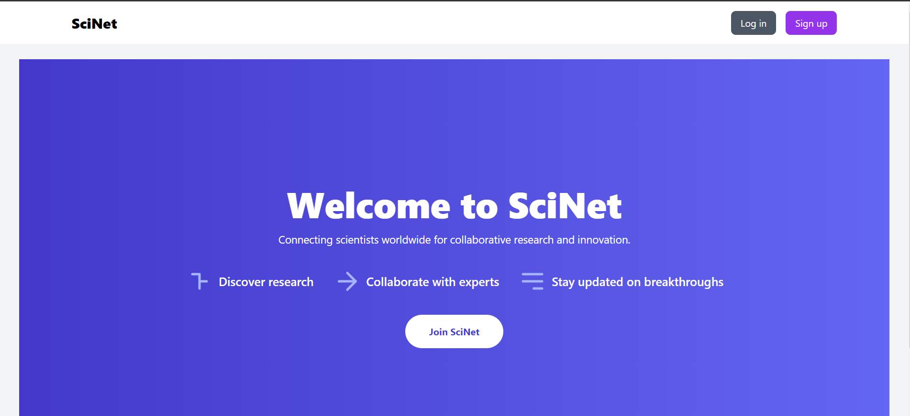
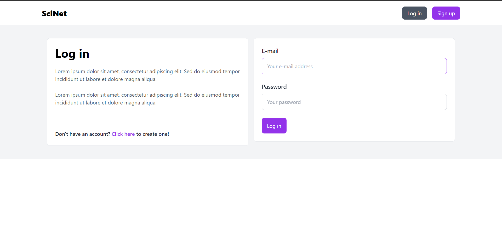
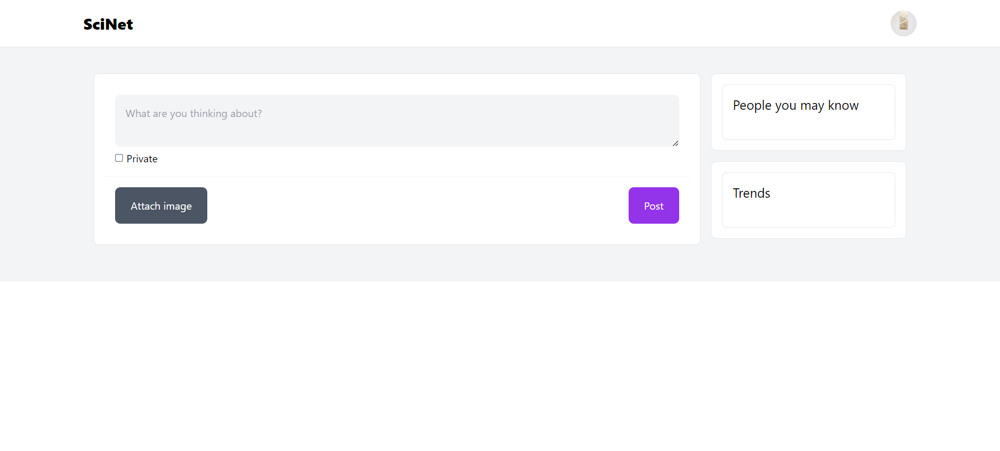
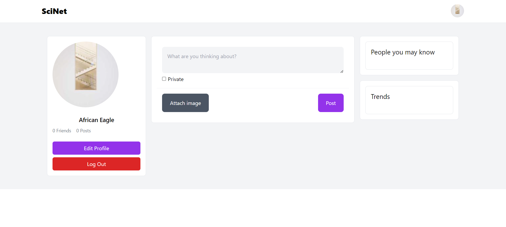
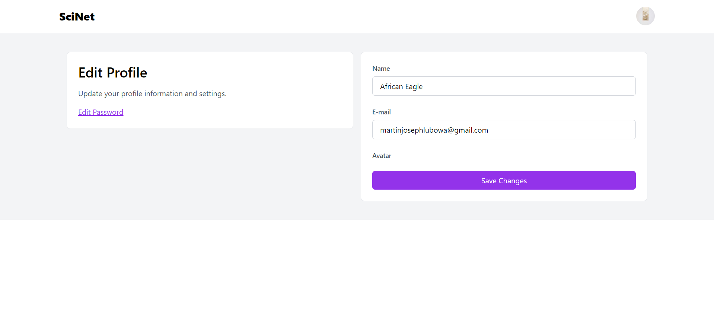
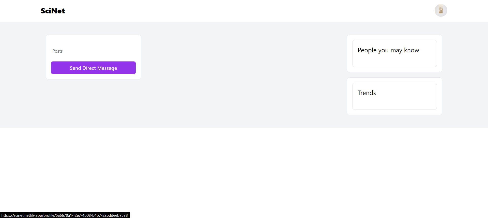

# SciNet - Connecting Scientists Worldwide

Welcome to SciNet, where scientists from around the globe come together for collaborative research and innovation. SciNet provides a platform to discover cutting-edge research, collaborate with experts, and stay updated on breakthroughs in various scientific fields.

Live demo: [https://scinet.netlify.app](https://scinet.netlify.app)

## Screenshots







## Key Features

- **Discover Research:** Explore a vast array of cutting-edge research topics and stay informed about the latest advancements in your field.

- **Collaborate with Experts:** Connect with fellow scientists, share your knowledge, and engage in collaborative research projects to drive innovation.

- **Stay Updated on Breakthroughs:** Receive real-time updates on groundbreaking discoveries and stay ahead in your scientific journey.

- **Join SciNet:** Unlock powerful features by joining SciNet, including the ability to create posts, follow other users, and participate in a dynamic and interactive scientific community.

## SciNet Platform Features

- **Create Posts:** Share your research findings, insights, and thoughts with the SciNet community through the easy-to-use post creation feature.

- **Follow Users:** Stay connected with your peers and stay updated on their latest contributions by following other scientists on SciNet.

- **Chatting Feature:** Engage in real-time conversations with fellow scientists, discuss research topics, and foster meaningful connections within the community.

- **Feed Features:** Customize your feed to receive relevant updates and posts from scientists and topics you follow, ensuring you never miss out on important information.

## Technology Stack

- **Frontend:** Vue.js
- **Backend:** Django REST Framework
- **Database:** SQLite

## Getting Started

### Frontend (Vue.js)

1. Navigate to the `frontend` directory.
    ```bash
    cd frontend
    ```

2. Install dependencies.
    ```bash
    npm install
    ```

3. Run the development server.
    ```bash
    npm run serve
    ```

4. Visit [http://localhost:8080](http://localhost:8080) in your browser.

### Backend (Django)

1. Navigate to the `backend` directory.
    ```bash
    cd backend
    ```

2. Install Python dependencies.
    ```bash
    pip install -r requirements.txt
    ```

3. Apply migrations.
    ```bash
    python manage.py migrate
    ```

4. Run the Django development server.
    ```bash
    python manage.py runserver
    ```

5. Visit [http://localhost:8000](http://localhost:8000) in your browser.

Join us in connecting scientists worldwide and contributing to the advancement of research and innovation.

## Author

- **Martin Lubowa**
- **Email:** martinubowa@outlook.com